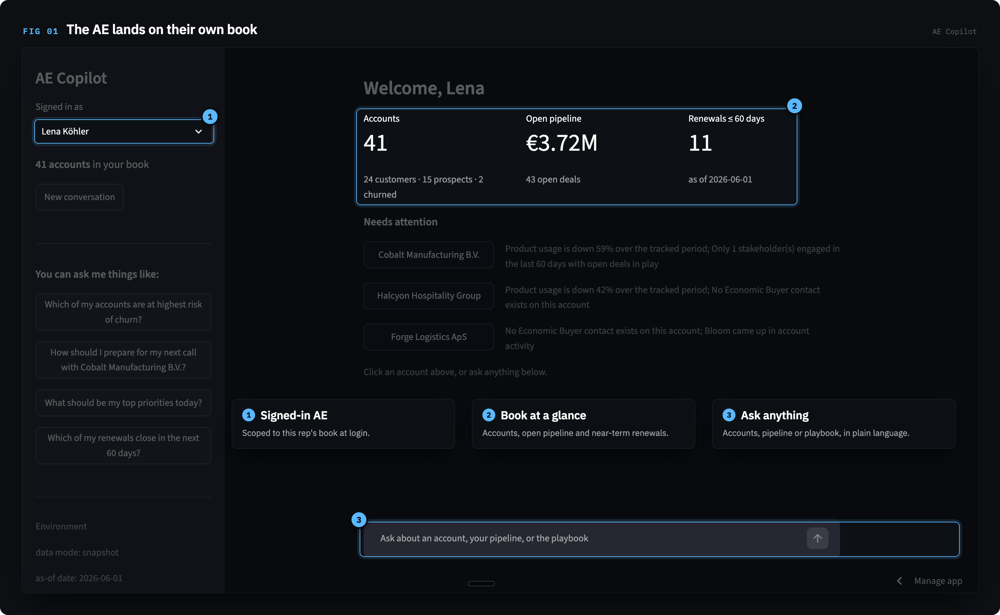
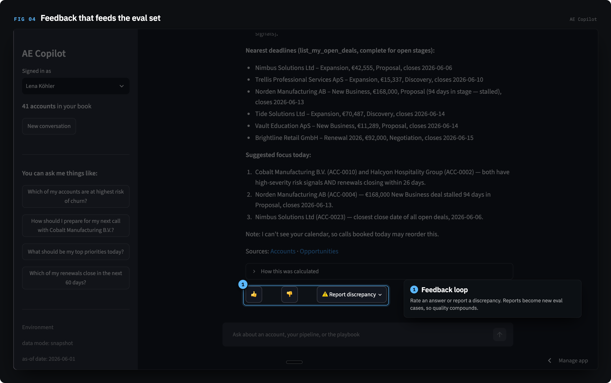
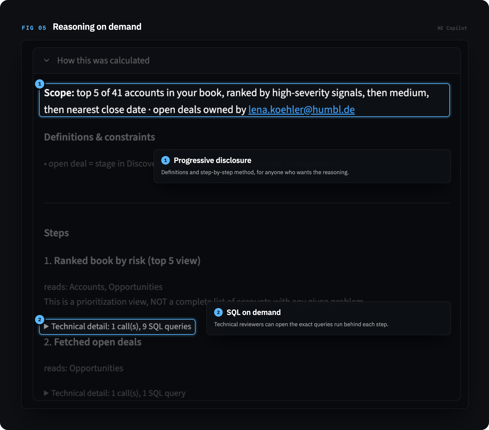
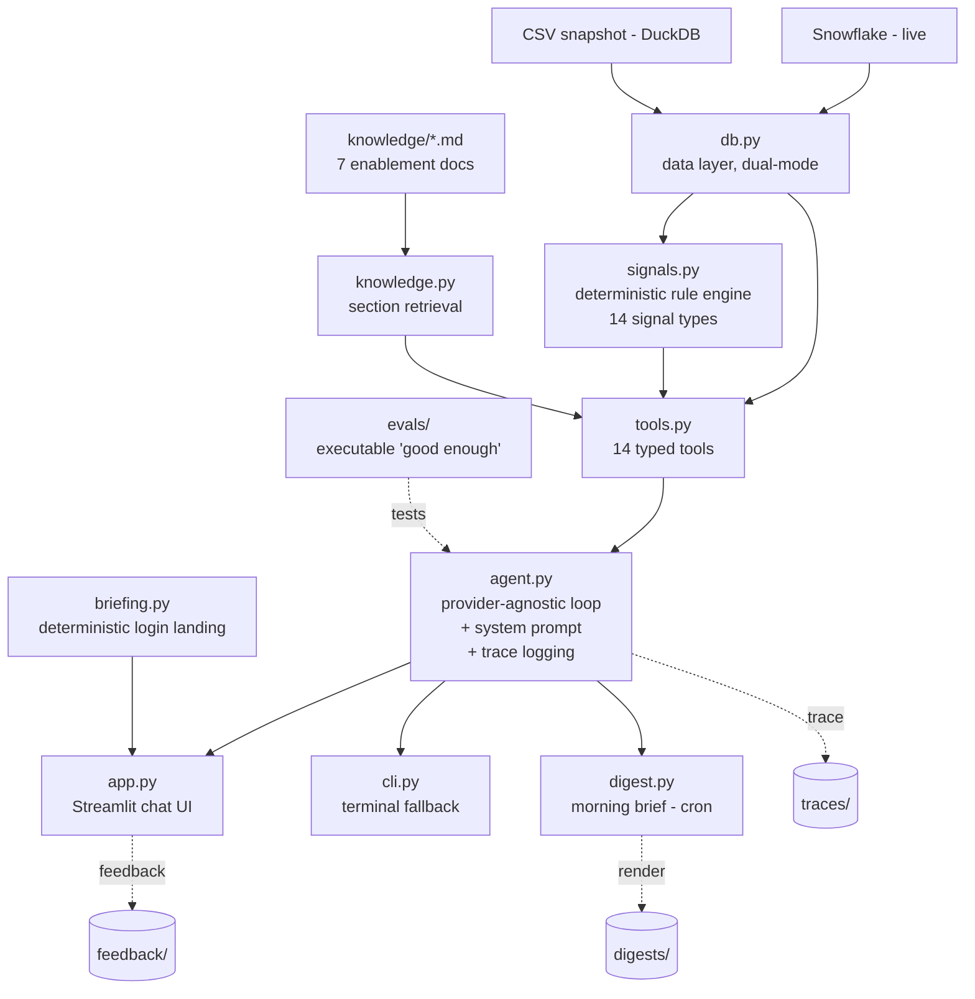

# AE Copilot

A grounded AI copilot for B2B sales. It watches an account executive's book, flags the renewals that are quietly slipping, and answers call-prep questions with a source on every claim. The parts where being wrong is unacceptable, risk detection, counting, and filtering, run in plain code rather than the model.




**[▶ Live demo](https://ae-copilot-demo.streamlit.app/)**  ·  **[The quality journey](QUALITY_JOURNEY.md)**

### A closer look

Users can rate any answer or report a discrepancy, and reported discrepancies become new evaluation cases.


The method behind each answer is one click away, down to the exact SQL.


---

## What it is

An independent prototype, built to show one idea end to end: an AI assistant that business users can actually trust.

- The rule engine finds the risks and does every count. The model orchestrates tools and writes the answer. It cannot invent a risk, cite a document it never read, or do arithmetic over rows.
- Quality is measured. 26 unit tests and 25 eval cases gate every change, graded by the opposite provider so the system does not grade its own answers. The full testing story is in [QUALITY_JOURNEY.md](QUALITY_JOURNEY.md).
- Provider-agnostic and read-only. Runs on OpenAI or Anthropic behind one switch, with no write access and no customer-facing text.

## What it demonstrates

- Anti-hallucination design: grounding rules, honest refusal, a source on every fact, and a clear line on what the model may and may not do.
- Eval-driven development: an executable definition of "good," a deterministic-plus-judge harness, and red-teaming, taking the suite from 8 of 12 passing to holding under repeated reliability runs.
- Pragmatic architecture: a ~40-line agent loop with no framework, exact retrieval instead of a vector database at this size, and one data layer that runs the same SQL over a snapshot or live Snowflake.
- Production instincts: every conversation traced, a closed feedback loop, access scoped to the signed-in user, and scope cuts with upgrade paths.

---

## The problem it solves

A mid-market account executive can spend five or more hours preparing for a single call. This tool surfaces the signal already in the data that nobody flags in time: a usage drop, a renewal window opening, a single-threaded deal with no economic buyer, a competitor named in a QBR note, an unresolved P1 ticket.

Two principles shape it. AEs need the signals they are missing, not a summary of what they know, so the core is a rule engine rather than a chatbot narrating the CRM. And one wrong fact ends adoption, so every claim is sourced and the risky work is code, not the model.

---

## Four core capabilities

1. Proactive risk detection. A deterministic engine (`signals.py`) checks 14 signal types against an account: usage decline, renewal windows, stalled deals, single-threading, missing buyer personas, quiet accounts, open and recent P1 tickets, competitor mentions, and data-quality problems. Each fired signal carries its evidence and the playbook rule behind it. The model ranks and explains signals but cannot invent one.
2. Multi-turn chat with citations. The AE asks anything about their accounts across turns. It fetches live data at the moment of the question, leads with what changed and what to flag, and sources every fact inline. The tool calls and exact SQL are one click away.
3. Grounded enablement lookup. The right battlecard section when a competitor is in play, the case study matching the account's industry and region, the playbook guidance for the stage. It only cites a document it actually retrieved.
4. Proactive morning digest. The same engine on a schedule across the book, ranked and composed into a short brief. Delivery is a labeled dry run in the prototype.

Under all of these sit honest refusal ("the CRM has no record of that," never a guess) and a closed feedback loop.

---

## Architecture

Risk detection, reference matching, prioritization, and every count are hand-written code. The model orchestrates tools and explains results; it cannot assert a risk the rules did not fire, cite a document it did not read, or write SQL.



A call-prep question flows like this: the UI sends the conversation and the AE's identity to `agent.py`; the model resolves the account, runs the risk sweep, pulls the relevant opportunities, activities, usage, and tickets, and retrieves any battlecard or case study; then it composes an answer with a source on every fact. Nothing is special-cased per account; the same machinery runs for all 75.

### Project structure

| Path | Role |
|---|---|
| `db.py` | The only file that touches data. Dual-mode behind one switch: `snapshot` runs SQL over local CSVs with DuckDB; `live` runs the identical SQL against Snowflake. |
| `signals.py` | Deterministic risk rules, each with a hardcoded threshold traceable to a playbook section. A rule fires with evidence or stays silent. |
| `knowledge.py` | Loads the enablement docs and serves them by section. No vector database; exact retrieval at this corpus size (~40KB) is more reliable and fully explainable. |
| `tools.py` | The 14 typed functions the model may call, over `db.py` and `signals.py`. Each validates its inputs and returns an instructive error, never an empty success. |
| `agent.py` | The provider-agnostic tool-calling loop (no framework), the system prompt that encodes the grounding rules, and per-conversation trace logging. |
| `app.py` | Streamlit chat UI: source chips and a login briefing for the AE; raw tool calls, method cards, and SQL one click away for engineers. |
| `cli.py` | Terminal chat, same agent, zero UI dependencies. |
| `briefing.py` | Deterministic login landing (book overview plus tailored question starters). Zero LLM calls. |
| `digest.py` | Morning brief across an AE's book, ranked by severity. Delivery is a labeled dry run. |
| `evals/` | `cases.py` (25 eval cases), `run_evals.py` (the gate), `unit_tests.py` (26 tool-layer checks), and saved `results_*.json` runs. |
| `data/` | Six snapshot CSVs: accounts, opportunities, contacts, activities, usage, tickets. All synthetic. |
| `knowledge/` | Seven enablement docs: playbook, ICP, Keystone and Bloom battlecards, objection handling, pricing cheatsheet, case studies. |
| `traces/`, `feedback/`, `digests/` | Runtime output. Sample runs are committed so you can see the shape of the data; in production they accumulate real AE conversations. |

---

## Quality

Four layers, from strict to human.

Deterministic checks. 26 unit tests (`evals/unit_tests.py`, no LLM, seconds to run) plus deterministic assertions on all 25 eval cases: which tools an answer had to call, the hard facts that must appear, and patterns that catch an invented number.

LLM-as-judge. 8 of the 25 cases add a binary pass/fail rubric for the semantic criteria, like whether it refused cleanly, flagged the data-quality problem, or gave a concrete discount answer. Graded at temperature 0 by the opposite provider, and the judge itself is audited against hand labels.

Trace logging. Every conversation is logged with timestamp, AE, provider, question, tool calls, results, answer, latency, and estimated cost, so failures can be reviewed against a real record.

Closed feedback loop. Any answer can be marked useful or not, or reported as a discrepancy, and it all lands in `feedback/`. Every verified discrepancy becomes a new eval case.

Run `python evals/unit_tests.py` then `python evals/run_evals.py` before any prompt or rule change.

### The quality journey

The assistant did not start reliable. The first suite passed 8 of 12 cases. The current one passes all 25 on a single run and 26 of 26 unit tests, and under a stricter check (every case run three times on both providers) it holds at 24 of 25 per provider, with one flaky case. Along the way, red-teaming surfaced real bugs: a pipeline total off by about a million euros, a churn-risk account dropped from a "which customers are declining" answer, a set-membership question answered with no tool calls. Each was traced to a cause, fixed, and turned into a test. [QUALITY_JOURNEY.md](QUALITY_JOURNEY.md) has the round-by-round timeline and a taxonomy of every failure.

---

## Key technical choices and trade-offs

| Choice | Alternative rejected | Why, and the trade-off |
|---|---|---|
| Deterministic signal rules | Ask the LLM to spot risks | Same account, same output, every time; individually testable; provenance built in. Trade-off: thresholds are fixed (see limitations). |
| The model never writes SQL | Free-form text-to-SQL | Hallucinated joins produce wrong facts, and trust is everything here. 14 curated, validated tools cover every access pattern. Trade-off: less flexibility on exotic one-off questions. |
| No agent framework | LangChain / LlamaIndex / vendor agent SDKs | The loop is about 40 lines and every line is explainable. Fewer moving parts, full visibility. |
| Direct doc loading by section | Vector database + embeddings | Seven small files. Exact section retrieval beats approximate search here and stays explainable. At a few hundred docs this becomes hybrid search. |
| Read-only by design | Write access to CRM | No write tools are configured; the assistant cannot mutate the data or the knowledge base. A prototype that writes to the CRM is a liability. |
| No customer-facing text generation | Draft emails and call scripts | It prepares the AE, it does not speak for them. Removes a whole class of hallucination risk. |

Guardrails, in short: read-only; no customer-facing text; every tool validates its inputs and returns an instructive error instead of an empty success; and data access is scoped to the signed-in AE at login, so the model text cannot change whose book it sees.

---

## Run it yourself

Fastest is the [live demo](https://ae-copilot-demo.streamlit.app/). To run locally:

```bash
pip install -r requirements.txt
cp .env.example .env        # add your API key(s)
streamlit run app.py        # chat UI
```

Terminal fallback, same agent, no UI dependencies:

```bash
python cli.py
```

Both run the same agent in `agent.py`.

### Configuration (`.env`)

| Variable | Values | Meaning |
|---|---|---|
| `LLM_PROVIDER` | `openai` / `anthropic` | which model runs the agent |
| `OPENAI_MODEL` / `ANTHROPIC_MODEL` | model name | defaults: `gpt-4o`, `claude-sonnet-5` |
| `DATA_MODE` | `snapshot` / `live` | local CSVs (dev, test, hosted demo) or Snowflake |
| `AS_OF_DATE` | date | the agent's "today" (see Data and limitations) |
| `OPENAI_API_KEY` / `ANTHROPIC_API_KEY` | key | secrets stay in `.env`, which is gitignored |

Snowflake credentials are only needed for `DATA_MODE=live`; see `.env.example`.

---

## Data and limitations

All data in this repo is synthetic; any resemblance to a real business is coincidental. The dataset stops on 2026-05-31, which has three consequences handled in code:

- `AS_OF_DATE` defaults to 2026-06-01, one day after the data ends, so relative-time logic behaves as it would in production. On real data the constant is removed.
- The usage data contains impossible negative values. They are excluded from trend math, and the assistant says it did so rather than dropping them silently.
- Signal thresholds (for example a 20% MAU drop, or a 90-day renewal window) are hardcoded in `signals.py`. Custom-threshold requests are out of scope.

## Out of scope

Agentic actions (drafting emails, writing to the CRM), latent-intent inference, cross-session memory, custom thresholds, and integrations (Slack, email, calendar, call recording). Each is a deliberate cut with an upgrade path. The digest's send step is a stub; in production it is a Slack DM per AE.

## About

Built by Sanjeev Rao as an independent demonstration of grounded, eval-driven AI product work. If you are hiring or want something like this for your sales team, the code and the [quality journey](QUALITY_JOURNEY.md) show how I work.

All data is synthetic. This project is not affiliated with any company whose product category it resembles.
