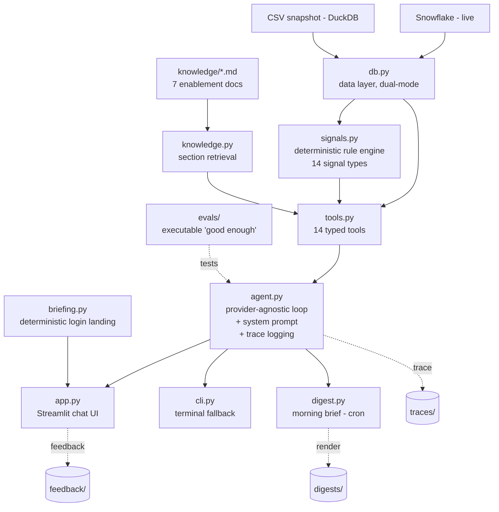

<!-- Replace the demo GIF below before publishing. Suggested: a 15-30s screen
     recording of the live app answering a call-prep question, showing the
     source chips and the "how this was calculated" panel. Drop the file at
     docs/demo.gif (create the docs/ folder). -->

# 🧭 AE Copilot

**A grounded AI copilot for B2B sales that never guesses a fact.** It watches an Account Executive's book of accounts, flags the renewals quietly slipping away, and answers call-prep questions with a source on every claim. The hard parts (risk detection, counting, filtering) run in deterministic code, not model judgment, because in sales one wrong fact ends adoption.


> **Placeholder.** Add a short screen recording at `docs/demo.gif` before publishing.

**[▶ Live demo](https://ae-copilot-sanjeevrao.streamlit.app/)**  ·  **[📈 The quality journey](QUALITY_JOURNEY.md)**

---

## TL;DR

This is an independent prototype, built on a fully synthetic CRM dataset (no real company or customer data). It exists to demonstrate one idea end to end: **you can build an AI assistant that business users actually trust, by keeping the model out of the parts where being wrong is unacceptable.**

- **Detection is deterministic, explanation is probabilistic.** A hand-written rule engine finds the risks and does every count; the model orchestrates tools and writes the answer. It cannot invent a risk, cite a document it never read, or do arithmetic over rows.
- **Quality is measured, not assumed.** 26 unit tests and 25 eval cases gate every change, graded by a cross-provider LLM judge so the system never grades its own homework. The full testing story, including every bug found and fixed, is in [QUALITY_JOURNEY.md](QUALITY_JOURNEY.md).
- **Provider-agnostic and read-only.** Runs on OpenAI or Anthropic behind one switch. No write access to the CRM, no customer-facing text generation.

---

## What this demonstrates

If you are evaluating this as evidence of AI product and engineering skill, here is what it shows:

- **Anti-hallucination system design** for a trust-critical domain: grounding contracts, honest refusal, provenance on every fact, and a clear line between what the model may and may not do.
- **Eval-driven development**: an executable definition of "good," a deterministic-plus-LLM-judge harness, red-teaming, and a suite that only ratchets. The assistant went from 8/12 to a suite that holds under repeated 3x reliability runs.
- **Pragmatic architecture**: a ~40-line agent loop with no framework, exact retrieval instead of a vector database at this corpus size, and a data layer that runs identical SQL over a local snapshot or live Snowflake.
- **Production instincts**: observability (every conversation traced), a closed feedback loop, scoped data access that can't be spoofed by a prompt, and deliberate scope cuts with stated upgrade paths.

---

## 🎯 The problem it solves

The user is a mid-market Account Executive carrying a book of roughly 40 accounts. This tool does not summarize what they already know. It surfaces the signal sitting in the data that nobody flags in time: a usage drop, a renewal window opening, a single-threaded deal with no economic buyer, a competitor named in a QBR note, an unresolved P1 ticket.

Two principles shape the build:

1. **AEs need missed signals, not summaries.** The core is a deterministic rule engine, not a chatbot narrating the CRM back to you.
2. **Trust is fragile and asymmetric.** One wrong fact or bad citation ends adoption. So every claim is sourced, the assistant refuses rather than guesses, and the risky work (detection, counting, filtering) is hand-written code, not model judgment.

---

## ⚡ Four core capabilities

1. **Proactive risk and gap detection.** A deterministic engine (`signals.py`) evaluates 14 signal types against an account: usage decline, renewal windows, overdue or stalled deals, single-threading, missing buyer personas, quiet accounts, open and recent-P1 tickets, competitor mentions, data-quality problems. Each fired signal carries its evidence and the playbook rule behind it. The model prioritizes and explains signals; it cannot invent one the rules did not fire.
2. **Multi-turn chat copilot with citations.** The AE asks anything about their accounts, across turns. It fetches live data at the moment of the question, leads a call-prep answer with what changed and what to flag, and sources every fact inline. Tool calls and the exact SQL are one click away.
3. **Grounded enablement lookup.** The right battlecard section when a competitor is in play, the case study matching the account's industry and region, the playbook guidance for the deal stage. It only cites a document it actually retrieved.
4. **Proactive morning digest.** The same engine on a schedule across the whole book, ranked under one framework and composed into a short brief. Delivery is a labeled dry run in the prototype.

Two behaviors sit under these rather than beside them: **honest refusal** ("the CRM has no record of that," never a guess) and a **closed feedback loop** (see [Quality](#-quality-how-i-know-it-works)).

---

## 🏗️ Architecture

🔑 **Detection is deterministic, explanation is probabilistic.** Risk signals, reference matching, prioritization, and every count and aggregation are hand-written code. The model orchestrates tools and explains results; it cannot assert a risk the rules did not fire, cite a document it did not read, run a data operation it is not configured for, or write SQL. All queries are hand-written and parameterized.



How a single call-prep question flows through the system:

1. The UI sends the conversation plus the signed-in AE's identity to `agent.py`.
2. The model resolves the account, then runs the risk sweep proactively.
3. It pulls detail: opportunities, activities, and for customers usage and tickets.
4. It retrieves any relevant battlecard or case study through the knowledge tools.
5. It composes an answer in the AE's shape (what changed, what to flag) with a source on every fact.

Nothing is special-cased per account; the same machinery runs for any of the 75 accounts.

### Project structure

| Path | Role |
|---|---|
| `db.py` | The only file that touches data. Dual-mode behind one switch: `snapshot` runs SQL over local CSVs with DuckDB; `live` runs the identical SQL against Snowflake. |
| `signals.py` | Deterministic risk rules, each with a hardcoded threshold traceable to a playbook section. A rule fires with evidence or stays silent. |
| `knowledge.py` | Loads the seven enablement docs and serves them by section. No vector database; exact retrieval at this corpus size (~40KB) is more reliable and fully explainable. |
| `tools.py` | The 14 typed functions the model may call. Thin wrappers over `db.py` and `signals.py`; each validates its inputs and returns an instructive error rather than an empty success. |
| `agent.py` | The brain. Provider-agnostic tool-calling loop (no agent framework), the system prompt that encodes the grounding contract, and per-conversation trace logging. |
| `app.py` | Streamlit chat UI: AE-facing source chips and a deterministic login briefing; raw tool calls, method cards, and SQL one click away for engineers. |
| `cli.py` | Terminal chat, same agent, zero UI dependencies. |
| `briefing.py` | Deterministic login landing rendered inside the chat window (book overview plus tailored question starters). Zero LLM calls. |
| `digest.py` | Proactive morning brief across an AE's book, ranked by severity. Delivery is a labeled dry run. |
| `evals/` | `cases.py` (25 eval cases), `run_evals.py` (the gate), `unit_tests.py` (26 tool-layer checks), and saved `results_*.json` runs. |
| `data/` | Six snapshot CSVs: accounts, opportunities, contacts, activities, usage, tickets. All synthetic. |
| `knowledge/` | The seven enablement docs: playbook, ICP, Keystone and Bloom battlecards, objection handling, pricing cheatsheet, case studies. |
| `traces/`, `feedback/`, `digests/` | Runtime output. Sample runs are committed here so you can see the shape of the observability and feedback data; in production they accumulate real AE conversations. |

---

## ✅ Quality: how I know it works

Four layers, from strict to human.

**Tier 1: Deterministic checks.** 26 tool-layer unit tests (`evals/unit_tests.py`, no LLM, runs in seconds) plus deterministic assertions on all 25 eval cases: tool-usage requirements (a call-prep answer that never fetched the opportunities is wrong even if it reads well), hard facts that must appear (numbers and names, stable across phrasings), and forbidden-fabrication patterns that check for the crime, an invented number, rather than the apology.

**Tier 2: LLM-as-judge.** 8 of the 25 eval cases add a binary PASS/FAIL rubric for criteria that are semantic by nature (did it refuse cleanly, did it flag the data-quality problem, was the discount answer concrete). Graded at temperature 0 by the *opposite* provider from the one that produced the answer, so the system never grades its own homework. Judges are themselves audited by hand-labeling a sample of verdicts.

**Tier 3: Trace logging.** Every conversation is logged with timestamp, AE, provider, question, tool calls, results, answer, latency, and estimated cost. A clean, auditable record to review failures against, not vibes.

**Tier 4: Closed feedback loop.** Every answer can be marked useful or not, or reported as a discrepancy, in the UI; all of it lands in `feedback/`. Every verified discrepancy becomes a new eval case, so a fixed bug can never silently return.

The suite only ratchets: it grew from 12 to 25 cases over the build. Each failure the tests caught was fixed by moving a responsibility (matching, counting, filtering, provenance, validation) out of the model and into deterministic code, then locked behind a regression test so the same bug cannot return.

Run `python evals/unit_tests.py` then `python evals/run_evals.py` before any prompt or rule change.

### 📈 The quality journey

The assistant did not start reliable. The first eval suite passed 8 of 12 cases. The current suite passes all 25 on a single run and 26 of 26 unit tests; under a stricter reliability check (every case run three times on both providers) it holds at 24 of 25 cases per provider, with one residual flaky case that differs by provider. In between, manual red-teaming surfaced real bugs: a pipeline total off by roughly a million euros, a churn-risk account silently dropped from a "which customers are declining" answer, a set-membership question answered with zero tool calls. Each bug was traced to a root cause, fixed at the right layer, and turned into a test.

[**QUALITY_JOURNEY.md**](QUALITY_JOURNEY.md) is the full audit: the score timeline round by round, and a taxonomy of every failure found, why it happened, where it was fixed, and the regression guard that now prevents it. It is the most honest part of this repo and the part worth reading if you care how the thing was actually built.

---

## ⚖️ Key technical choices and trade-offs

| Choice | Alternative rejected | Why, and the trade-off |
|---|---|---|
| Deterministic signal rules | Ask the LLM to spot risks | Same account, same output, every time; individually testable; provenance built in. Trade-off: thresholds are fixed (see limitations). |
| The model never writes SQL | Free-form text-to-SQL | Hallucinated joins are wrong-fact factories, and trust is the whole game. 14 curated, validated tools cover every access pattern. Trade-off: less flexibility on exotic one-off questions. |
| No agent framework | LangChain / LlamaIndex / vendor agent SDKs | The loop is ~40 lines and every line is explainable. Fewer moving parts, full visibility. |
| Direct doc loading by section | Vector database + embeddings | Seven small files. Exact section retrieval beats approximate search here and stays explainable. At a few hundred docs this becomes hybrid search. |
| Read-only by design | Write access to CRM | No write tools are configured; the assistant cannot mutate the data or the knowledge base. A prototype that writes to the CRM is a liability. |
| No customer-facing text generation | Draft emails and call scripts | It prepares the AE, it does not speak for them. Removes a whole class of hallucination risk. |

**Guardrails**, in one place: read-only; no customer-facing text; every tool validates its inputs (a malformed or hallucinated account ID returns an instructive error, never an empty success the model narrates as "no data"); scoped data access (the signed-in AE's identity is set at login and never taken from model text, so "whose book" cannot be spoofed by a prompt).

---

## 🚀 Run it yourself

The fastest way to try it is the [live demo](https://ae-copilot-sanjeevrao.streamlit.app/). To run locally:

```bash
pip install -r requirements.txt
cp .env.example .env        # add your API key(s)
streamlit run app.py        # chat UI
```

Terminal fallback, identical agent, no UI dependencies:

```bash
python cli.py
```

Both surfaces run the same agent in `agent.py`; the UI is disposable.

### Configuration (`.env`)

| Variable | Values | Meaning |
|---|---|---|
| `LLM_PROVIDER` | `openai` / `anthropic` | which model runs the agent |
| `OPENAI_MODEL` / `ANTHROPIC_MODEL` | model name | defaults: `gpt-4o`, `claude-sonnet-5` |
| `DATA_MODE` | `snapshot` / `live` | local CSVs (dev, test, hosted demo) or Snowflake |
| `AS_OF_DATE` | date | the agent's "today" (see [Data notes](#-data-notes-and-limitations)) |
| `OPENAI_API_KEY` / `ANTHROPIC_API_KEY` | key | secrets stay in `.env`, which is gitignored |

Snowflake credentials are only needed when `DATA_MODE=live`; see `.env.example` for the auth options.

---

## ⚠️ Data notes and limitations

**All data in this repo is synthetic.** The companies, contacts, deals, and enablement content are invented; any resemblance to a real business is coincidental. The dataset stops on **2026-05-31**. Three consequences, handled explicitly:

- **Anchored "today."** `AS_OF_DATE` defaults to `2026-06-01`, one day after the data ends. On the real clock the last six weeks of the dataset would be empty and every account would look dead. All relative-time logic reads from this anchor. On production data the constant is deleted.
- **Corrupt values excluded.** The usage data contains negative MAU and login values, which are impossible. They are excluded from trend math, and the assistant says it did so rather than silently dropping them.
- **Fixed thresholds.** Signal thresholds (for example, a 20% MAU drop as a decline, a 90-day renewal window) are hardcoded in `signals.py`. Custom-threshold requests ("flag usage drops over 25%") are not processed. Out of scope for the prototype.

---

## ✂️ Out of scope for the prototype

Agentic actions (drafting emails, writing to the CRM), latent-intent inference, cross-session memory, custom thresholds, and integrations (Slack, email, calendar, call-recording tools). Each is a deliberate cut with a stated upgrade path, not a gap. The digest's send step is a labeled stub; in production it is a Slack DM per AE.

---

## About

Built by Sanjeev Rao as an independent demonstration of grounded, eval-driven AI product design. If you are hiring for AI product or engineering work, or want something like this built for your sales team, the code and the [quality journey](QUALITY_JOURNEY.md) are the fastest way to see how I work.

*All data is synthetic. This project is not affiliated with any company whose product category it resembles.*
